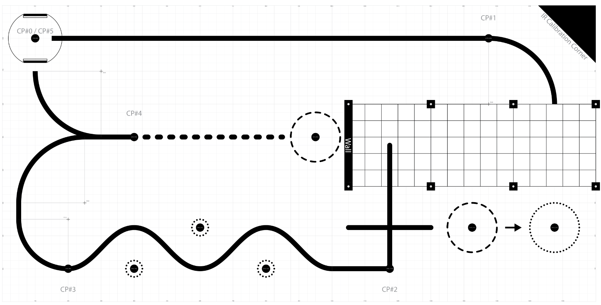
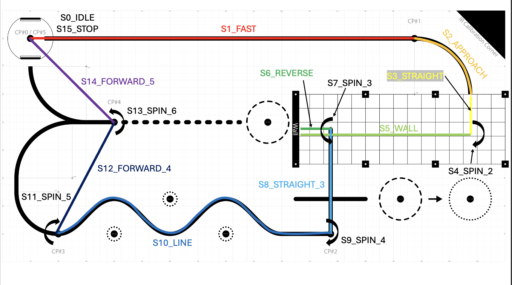

# Final Project Task

To complete the ME 405 term project, teams are tasked with using their completed robots through a playfield of specific checkpoints. The robots should follow each of the individual checkpoints in order and focus on not just speed at which the cource is completed, but also for repeatability in performance. This page will describe the scenerio and characteristics of the final task requirements and then demonstrate our teams solution in solving this task.

## The Final Task

Above is an image of the playfield given to the teams for the final task. This section will walkthrough the requirements for each section of the final task and outline some of the bonuses/penalties that are available on the playfield. 

### 1. Checkpoint 0 to Checkpoint 1

Checkpoint 0 will act as the starting point for all robots. The robot can be place at whatever heading desired, but likely will be started in the direction toward checkpoint 1. The distance to checkpoint 1 is a long straightaway and can test the robot's ability on both line following and fast pace movement. While line following is not explicitly required, it will be very beneficial as the distance between checkpoint 0 and checkpoint 1 can be quickly covered.

### 2. Checkpoint 1 to Checkpoint 2

###The path from checkpoint 1 to checkpoint 2 is started with a slight line curve into the garage, a enclosed garage that has aluminum extrusions and fencing to enclose the area with a wall at the other end, and then another lined section at the garage exit. Teams are to enter the garage from the entrance near checkpoint 1, maneuver through the garage carefully, use the wall on the other side as an object to detect using bump sensors, and then exit the garage and to checkpoint 2. 

Between these 2 checkpoints is the first opportunity for a bonus. At the lined section near the garage exit, a cup will be standing in the dotted line. To receive this bonus, the robot is to push the cup from the dashed line into the dotted line (see arrow). This bonus could be used a time deduction in the team's overall track performance. 

### 3. Checkpoint 2 to Checkpoint 3

From checkpoint 3 to checkpoint 4 is a lined section known as the slalom. This curved path is to test the robot's line following capabilities and to see if the PID controllers can accurately correct the steering of the robot. 

Within this section is the first instance of possible penalties. At every anti-peak, is a ping pong ball resting on a large hex nut denoted as a dark circle surrounded by a dotted line. If the robot were to knock these ping pong balls off of their stands, then this would lead to an addition to the robot's time performance. This would task teams with highly improving their robot's line following performance so as to avoid these penalties. 

### 4. Checkpoint 3 to Checkpoint 4

The distance from checkpoint 3 to checkpoint 4 has a curved line path. While this distance could be covered with just line following, there is a Y-section near the end of the path that could cause problems if using line following. However, if teams accurately navigate to checkpoint 4 using this path, it would line them up for the final bonus available on this track.

The final bonus is to push a plastic cup out of the ring next to the wall of the garage. While teams are lined up if they reach checkpoint 4 using the line following, the wall prevents them from pushing the cup from this head on orientation. In order to receive the bonus, teams will likely have to move to the side of the cup to push it out of the circle.

### 5. Checkpoint 4 to Checkpoint 5

The final checkpoint is from checkpoint 4 to checkpoint 5. If avoiding the bonus cup near the wall, the teams would need to rotate to the opposite heading from which they started at and then line follow again back through the Y-section and this time take the path up to checkpoint 5. This would serve as the end of the course as checkpoint 5 and checkpoint 0 are the same spot. 

## Our Team's Process for the Final Task
Now that the characteristics of the final task have been described, we can now describe how our team went about completing this task. 

Our team decided to complete this task as an implemented task in the scheduler, similar to that of the motor, line following, and state estimation tasks. The task itself is a large multi-part FSM that transfers between states once it has reached certain corresponding aspects. Below is a revision on the playfield that shows where exactly each state of the FSM is. 

### 1. S0_IDLE
In the idle state, the robot initializes preliminary parameters in preperation for the next state. With the motor flags not set to high yet, the high speed setpoint is set for the motors and line following is disabled. The idle state then sets the motor flags and observer flags to high before changing over to the sprint state.

### 2. S1_SPRINT
In the sprint state, the robot continues its high speed sprint. The sprint state actively reads the heading of the robot to try and find any possible drift that could occur from the sprint. It then corrects the motor speeds to help correct this possible drift as the robot approaches checkpoint 1. The absolute x-position of the robot is then compared to a "slow down distance" and once the slow down distance has been reached, the setpoint speed is changed to a much slower speed and line following is enabled before moving into the approach state.

### S2_APPROACH
In the approach state, 
