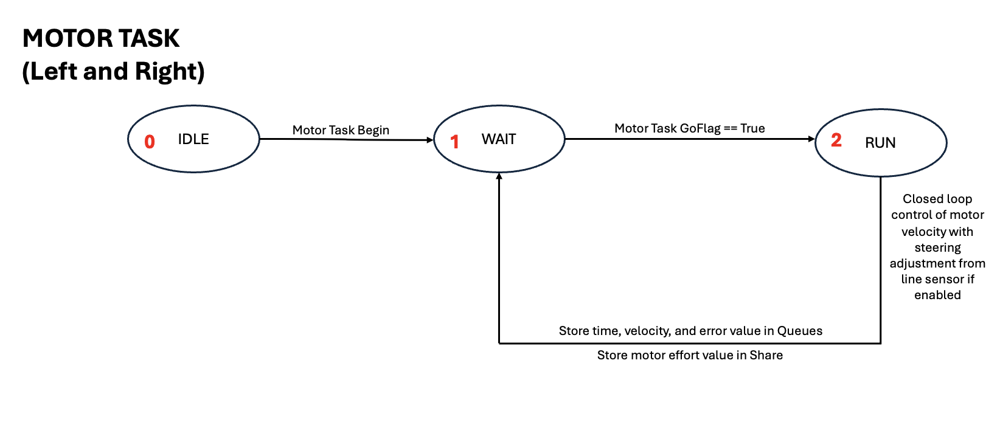
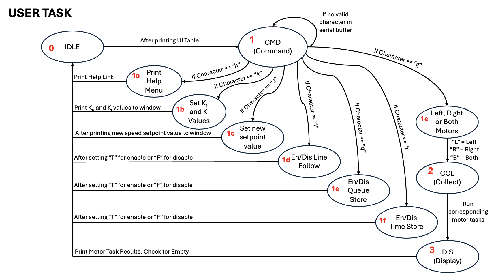
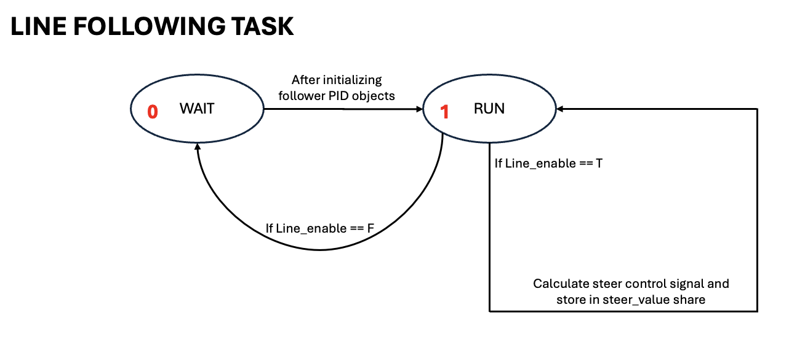
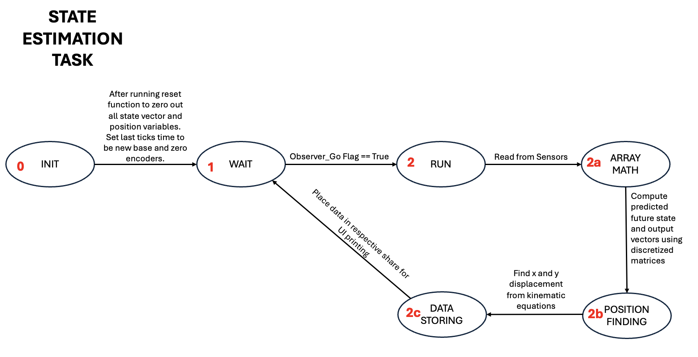
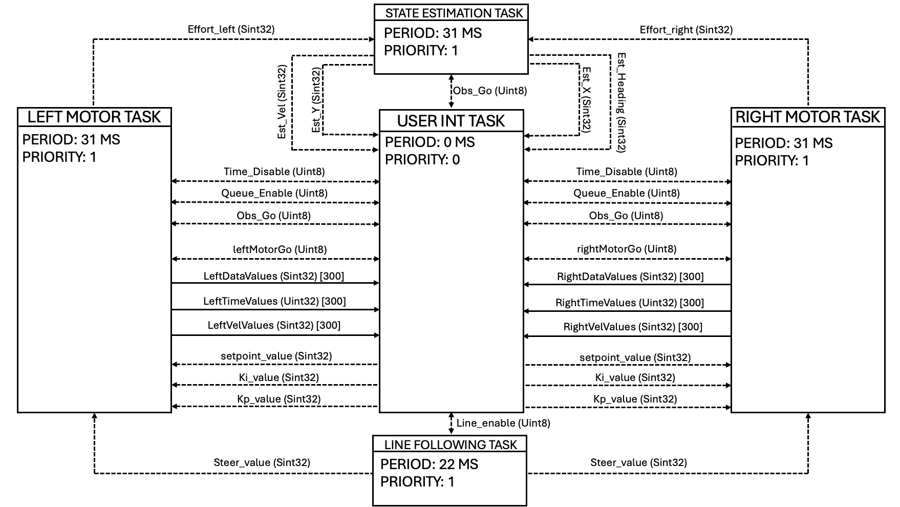

# Task Descriptions
This page will go more in depth into each individual task that is created and run in the cooperative scheduler. Each task will have an accompanying state transition diagram to demonstrate the changes in state for each FSM style task. An entire task diagram will then show the total framework for how each task cooperates with each other.

## Motor Task (task_motor)
The motor task is responsible for changing motor speeds based on a setpoint value. There are two individual motor tasks in the scheduler: one for the right motor and one for the left motor. A PI controller is used to help change the motor effort to reach the setpoint speed. To handle turns, a steering value is calculated from the line following task and stored in a share for the motor task to use. Depending on which motor task is being run, the wheel is either slowed down or sped up according to the necessary turn direction. There are also clamps based on the motor effort set function and the error value to prevent any over shooting beyond hardware capabilities. Debugging can be done by enabling time and motor value falgs (velocity and position) from the user interface.

## User Interface Task (user_task)
The user interface task is responsible for interacting with the user from the PuTTY port to activate certain aspects of the robot. The user is to input certain characters to change or activate various things. The following inputs are possible ways to interact with the user interface to change the control of the robot:

1. "h" or "H"
   
Entering these characters will print the help menu for the robot. This help menu will help users debug and create new things with just a quick      description. Run our code to see this new tool!   
  
2. "k" or "K"

Entering these characters will allow the user to change the gain values for the PI motor speed controller. There are default values made with       the code, but these values can be changed through the user interface.
  
3. "s" or "S"

Entering these characters will allow the user to change the setpoint speed value for the motors. This value can be changed to debug and test the    controllers for the motors. 
  
4. "l" or "L"

Entering these characters will allow the user to enable or disable line following for the robot. By default, line following is enabled and must     be turned off through the user interface or another task.
  
5. "q" or "Q"

Entering these characters will allow the user to enable or disable queues. For ease of testing, some instances may not need the robot to store      and print data from the queues. By disabling the queues in these cases, the robot procesing power can be conserved for other uses.
   
6. "t" or "T"

Entering these characters will allow the user to enable and disable time value storage. Similar to the queue enable/disable, this function will     allow the user to not store and print time values when necessary.
   
7. "g" or "G"

Entering these characters will allow the user to activate a step response from the motors. A secondary prompt will ask the user to enter another character to specify which motors to run. In this case, "L" = Left, "R" = Right, and "B" = Both. 
   

## Line Following Task (task_line)

The Line Following Task is responsible for calculating steering correction signals for the motors when in line following scenarios. See State Estimation task for turning in non-line following scenarios. The task utilizes the QTR-8A IR sensor driver (line_follower.py) to find an error signal and utilize this signal in the PID controller. As the sensor driver calculates a distance to the centroid of the detected line from the center of the sensor, this distance is directly used as the error for the PID controller. The PID controller then converts the error signal into a steering signal that is sent to the motor task through a share to correct the speed of the motors.

Different standardization, normalization, and filterting techniques are applied to the line following task to help reduce any noise or possible misreads from the sensor that could cause issues when running. For example, the task takes multiple samples to reduce possible noise and then standardizes the readings based on the minimum and maximum values observed during one capture. Some other features like lost line holds, steer clamps, and filters to remove sensor noise have also been added in to refine the operation of the task.

## State Estimation Task (task_state)

The state estimation task is responsible for utilizing information from the BNO055 Inertial Measurement Unit (IMU), enocder readings, and motor effort values to do discretized predictions about the changes in state of the robot. The state estimation task utilizes discretized matrices (AD and BD) to give weights to certain values in the prediction of the state based on the robot's dynamic model and sensor readings combined. The discretized matrices matrices were pre-determined during the creation of this task and automatically stored inside the code. Once the observer has created it's predictions, these predictions are then also utilized to predict X and Y position which were not apart of the obserber's state vector. 

## Task Diagram

The below diagram demonstrates how each task cooperates will each other in creating an adaptable Romi robot. The diamgram follows the Task Diagram format where shares are denoted with dotted lines and queues are denoted with solid lines. Each share/queue has it's corresponding data type and queue also has it's length. Each box represents a task running within the scheduler. The task boxes also include their corresponding period and priority that is defined when the task objects are appended to the task list. 

